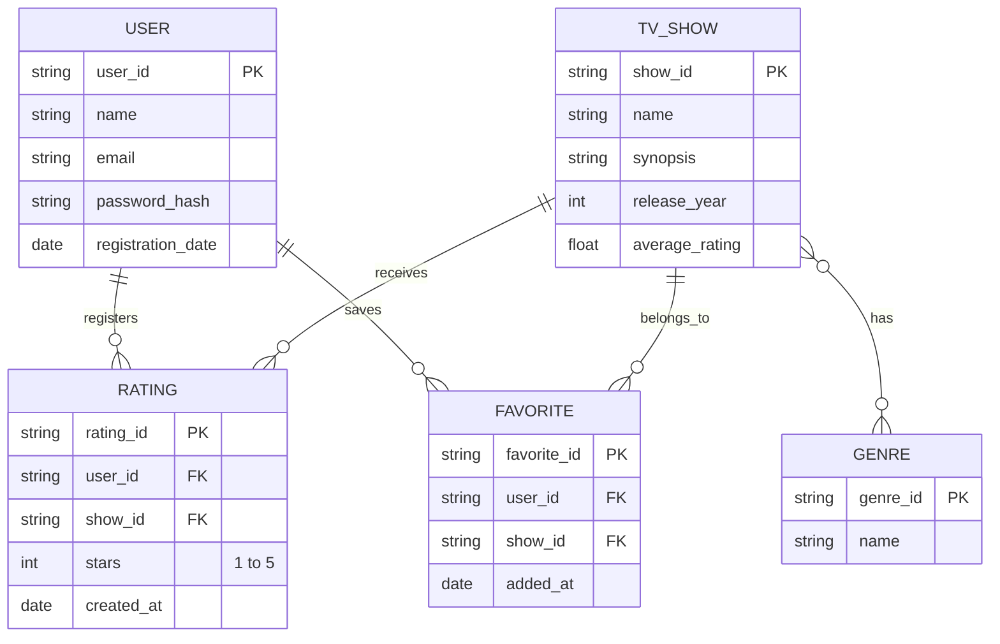

# Code Format 

### USER (EPIC 6 & 7): Stores credentials and basic data generated during user registration and login.
### TV_SHOW (EPIC 1 & 2): Contains the data required for the catalog. The average_rating attribute satisfies HU-04.2, which is calculated and updated automatically every time a new rating is added.
### GENRE (EPIC 3): Allows categorizing TV shows. In Firestore, the many-to-many relationship (TV_SHOW }o--o{ GENRE) can be optimally resolved by storing an Array of genre IDs directly within the TV Show document.
### RATING (EPIC 4): An intermediary entity that breaks the many-to-many relationship between Users and TV Shows. It tracks how many stars a specific user assigned to a particular TV show.
### FAVORITE (EPIC 5): Maps which TV shows a user has saved to "My List". In a pure Firestore schema, this can be structured as a subcollection within USER named favorites.
