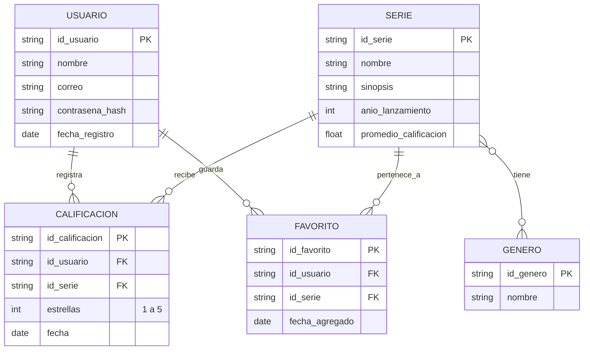

# Formato de codigo 

# Descripción 
### USUARIO (EPIC 6 y 7): Almacena las credenciales y datos básicos generados en el registro e inicio de sesión.

### SERIE (EPIC 1 y 2): Contiene los datos requeridos por el catálogo. El atributo promedio_calificacion resuelve la HU-04.2, calculándose y actualizándose cada vez que se agregue una calificación.

### GENERO (EPIC 3): Permite categorizar las series. En Firestore, la relación de muchos a muchos (SERIE }o--o{ GENERO) se puede resolver de forma óptima guardando un Array de IDs de géneros directamente dentro del documento de la Serie.

### CALIFICACION (EPIC 4): Entidad intermedia que rompe la relación muchos a muchos entre Usuarios y Series. Registra cuántas estrellas asignó un usuario específico a una serie.

### FAVORITO (EPIC 5): Permite mapear qué series ha guardado el usuario en "Mi Lista". En un esquema puro de Firestore, esto se podría estructurar como una subcolección dentro de USUARIO llamada favoritos.
